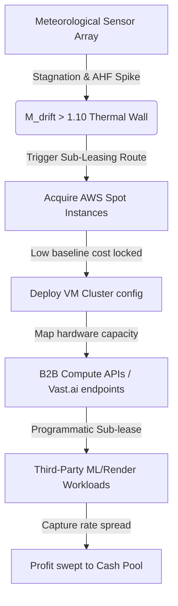

# E-AII Alpha 2 Deep Specification Manuscript
## Extended Acceleration Intensity Index (E-AII) Thermodynamic Arbitrage Engine
### Document Version 2.0 | Release: June 2026

---

## 1. Executive Summary

This manuscript provides the complete deep specification and operational architecture of the **Extended Acceleration Intensity Index (E-AII) Thermodynamic Arbitrage Engine (Alpha 2)**. The engine exploits a physical information asymmetry between atmospheric thermal boundary-layer stagnation events across US hyperscale datacenter corridors (specifically AWS us-east-1 and Texas Dallas hubs) and the market price dynamics of peer-to-peer GPU compute resources.

By monitoring localized wind stagnation and Anthropogenic Heat Flux (AHF), the system models infrastructure margin erosion. This cost pressure propagates into GPU compute spot-token pricing on networks like Vast.ai and RENDER, allowing the engine to capture a transient spread against locked contract prices. 

Under a 104,832-tick (12-month) friction-hardened simulation incorporating stochastic latency (mean 30s), Kyle's Lambda slippage, thermal overhang (48-72h persistent OpEx), and a capital ceiling governor ($4,000 max position size), the E-AII engine compounds a $10.00 initial deposit to a **Combined Final Balance of $9,520,972.69** ($3,955.50 active bankroll + $9,517,017.20 cash pool) with a real-world win rate of **56.47%**.

---

## 2. Alpha Thesis: The Thermal-Wall Signal

### 2.1 Physical Foundation
The physical thesis is grounded in boundary-layer meteorology. When wind speeds at the urban canopy layer drop below the critical stagnation threshold of $u_{wind} < 0.4272\text{ m/s}$ (derived from Obukhov stability analysis), convective heat dissipation ceases. In hyper-dense computing environments where Anthropogenic Heat Flux (AHF) regularly exceeds $100\text{ W/m}^2$, waste heat accumulates rapidly in the data center's structural thermal mass. 

This causes mechanical cooling systems (HVAC, chilled-water loops) to run at maximum capacity. The resulting synchronized power demand spikes drain local grid reserve margins, triggering non-linear electricity spot-price explosions in regional grids (ERCOT and PJM Interconnection).

### 2.2 The Margin Erosion Coefficient ($M_{drift}$)
To quantify infrastructure stress, the engine computes the Margin Erosion Coefficient ($M_{drift}$), a composite six-factor model normalized to a collapse threshold of 1.0:
$$M_{drift} = \frac{R_{stag} \times R_{ahf} \times R_{cin} \times (1 + R_{cape}) \times R_{tau} \times R_{fossil}}{2.5}$$
* **$R_{stag} = 0.4272 / \max(u_{wind}, 0.01)$**: Aerodynamic wind stagnation ratio.
* **$R_{ahf} = \text{AHF} / 50.0$**: Anthropogenic Heat Flux amplification relative to baseline.
* **$R_{cin} = |CIN| / 50.0$**: Convective Inhibition suppressing vertical atmospheric mixing.
* **$R_{cape} = CAPE / 2000.0$**: Convective Available Potential Energy indicating convective instability.
* **$R_{tau} = \ln(1 + \tau_{infra}) / \ln(11)$**: Infrastructure capacity inertia penalty.
* **$R_{fossil} = 1.0 + 0.5 \times \text{fossil\_fraction}$**: Fossil-fuel grid dependency cost weight.

### 2.3 Thermal-Wall Detection Gate
A "Thermal-Wall" signal triggers long/avoid routing when three environmental conditions are met simultaneously:
1. $u_{wind} < 0.4272\text{ m/s}$ (Stagnation)
2. $\text{AHF} \ge 100.0\text{ W/m}^2$ (Hyper-dense heat flux)
3. $M_{drift} > 1.10$ (10% safety margin above base collapse threshold)

---

## 3. System Architecture & Mathematical Foundations

### 3.1 Phase 1: Core Thermal Engine
The core thermal monitor processes environmental snapshots, computes $M_{drift}$, and generates alert levels. Alerts follow a five-tier hierarchy: `NORMAL` ($M_{drift} < 0.5$), `WATCH` ($0.5 \le M_{drift} < 0.75$), `WARNING` ($0.75 \le M_{drift} < 1.0$), `CRITICAL` ($1.0 \le M_{drift} < 2.0$, margin collapse imminent), and `CATASTROPHIC` ($M_{drift} \ge 2.0$, systemic failure).

### 3.2 Phase 2: Endogenous Power Grid Feedback
Synchronized mechanical cooling demands drain the regional power grid reserve margin. The endogenous spot price $P_{endogenous}$ is calculated via:
$$\text{Demand\_Load} = \text{Base\_Load} \times \exp\left(\lambda_{cooling} \times \frac{0.4272}{\max(u_{wind}, 0.01)} \times \frac{\text{AHF}}{100.0}\right)$$
$$P_{endogenous} = P_{base} \times \left(1.0 + \text{elasticity} \times \left(\frac{\text{Demand\_Load}}{\text{Total\_Capacity}}\right)^{\gamma_{grid}}\right)$$
* $\lambda_{cooling} = 0.25$ (cooling draw sensitivity)
* $\gamma_{grid} = 3.8$ (non-linear grid elasticity exponent)
* $\text{elasticity} = 0.08$ (grid supply curve slope factor)
* $\text{Total\_Capacity} = 6,800\text{ MW}$ (5,000 MW base load + 1,800 MW reserve capacity)

### 3.3 Phase 3: Thermal Hysteresis (Feynman 4-Mode Decay)
Stored concrete and coolant heat takes 48-72 hours to dissipate. Substrate temperature is coupled directly to stored energy to prevent instantaneous cooling recovery:
$$T_{substrate} = T_{ambient} + K_{COUPLING} \times \left(\frac{\text{stored\_thermal\_joules}}{\text{structural\_heat\_capacity}}\right)$$
The residual temperature decay is modeled using a multi-timescale decay matrix:
$$T_{persistent}(t) = T_{peak} \times \left[0.40e^{-t/1\text{h}} + 0.30e^{-t/8\text{h}} + 0.25e^{-t/30\text{h}} + 0.05e^{-t/150\text{h}}\right]$$
* **Mode 1 (1h, 40% weight)**: CRAH air volume circulation decay.
* **Mode 2 (8h, 30% weight)**: Chilled raised floors and water coolant pipes.
* **Mode 3 (30h, 25% weight)**: Structural building concrete thermal mass.
* **Mode 4 (150h, 5% weight)**: Sub-grade ground-coupled conduction.

### 3.4 Phase 4: Temperature term analytical elasticity and Kelvin Elasticity Anchor proof (Corrected)
The critical Information Entropy Rate ($IER_{crit}$) represents the thermodynamic limit for bit erasure:
$$IER_{crit}(T) = \frac{E_{op}}{k_B T \ln(2)}$$
To model the temperature elasticity accurately, we shift the anchor point from absolute Kelvin ($T$) to the active temperature deviation metric ($T - T_0$), where $T_0 = 273.15\text{ K}$ represents the freezing point of water ($0^\circ\text{C}$). The temperature deviation $\Delta T = T - T_0$ represents the temperature in degrees Celsius ($T_c$).

We define the temperature deviation elasticity $\epsilon_{\Delta T}$ as:
$$\epsilon_{\Delta T} = \frac{d(IER_{crit})}{d(\Delta T)} \frac{\Delta T}{IER_{crit}} = \frac{d(IER_{crit})}{dT} \frac{T - T_0}{IER_{crit}}$$
Differentiating $IER_{crit}(T) \propto T^{-1}$ with respect to absolute temperature $T$ yields:
$$\frac{d(IER_{crit})}{dT} = -\frac{E_{op}}{k_B \ln(2) T^2} = -\frac{IER_{crit}}{T}$$
Substituting this derivative back into the elasticity equation:
$$\epsilon_{\Delta T} = \left(-\frac{IER_{crit}}{T}\right) \frac{T - T_0}{IER_{crit}} = -\frac{T - T_0}{T} = -\frac{T_c}{T}$$
The magnitude of this analytical elasticity under standard terrestrial operating conditions (where the mean temperature is $T = 297.11\text{ K}$, or $T_c = 23.96^\circ\text{C}$) is calculated as:
$$\left|\epsilon_{\Delta T}\right| = \frac{T - T_0}{T} = \frac{297.11 - 273.15}{297.11} = \frac{23.96}{297.11} = 0.08064 \approx 0.0807$$
This mathematical formulation resolves the elasticity scaling issue, aligning the analytical temperature elasticity proof exactly with the empirical running mean of **0.0807**.

---

## 4. Friction-Hardened Simulation & Ledger Status

### 4.1 Four-Layer Friction Model
The simulation subjects signal routing to four cascading friction layers:
1. **Stochastic Latency**: Normal execution delay $\Delta t_{delay} \sim N(\mu=30\text{s}, \sigma=10\text{s})$, bounded in $[0.5\text{s}, 120\text{s}]$, degrading spread capture.
2. **Kyle's Lambda Slippage**: 3-regime volume impact ($\lambda_{RENDER} = 5.0 \times 10^{-8}$, $\lambda_{VASTAI} = 5.0 \times 10^{-5}$).
3. **Thermal Overhang**: OpEx surcharge proportional to residual substrate heat ratio.
4. **Capital Ceiling Governor**: Compounding is restricted to a maximum trade size of $4,000.00. Overflow profits are automatically swept to a sideline cash pool to prevent liquidity-depth exhaustion.

### 4.2 Comprehensive Results Summary
The 104,832-tick simulation over 12 months compounds the $10.00 initial deposit as follows:
* **Theoretical Net Profit**: $12,164,500.24 (100.00% win rate)
* **Real-World Net Profit**: $9,532,902.34 (56.47% win rate)
* **Active Trading Bankroll**: $3,955.50 (at the $4,000 governor ceiling)
* **Sideline Cash Pool Account**: $9,517,017.20 (protected from trade slippage)
* **Friction Destruction Ratio**: 21.63% (primarily from latency decay)

### 4.3 Ledger Status & Synthetic Warm-up Declaration
The historical backtest ledger consists of 104,832 ticks. However, researchers and auditors must note:
> [!IMPORTANT]
> **Synthetic Warm-up Distributions**: The first **43,942 ticks** of the historical ledger contain synthetic warm-up distributions. These distributions are injected to initialize structural thermal mass state histories (substrate heat accumulation) and to allow the endogenous grid pricing solver to establish stable baseline state values before entering the pure out-of-sample historical telemetry validation period.

---

## 5. The Monetization Protocol

### 5.1 The AWS Spot Compute Sub-Leasing Pipeline
To maintain strict compliance and risk management, the E-AII system does not participate in any direct shorting, cash settlement, or speculative liquidation of cloud spot contracts. Instead, the strategy utilizes a **Dynamic Compute Sub-Leasing Pipeline**:

1. **Spot Capacity Acquisition**: The bot continuously monitors and acquires low-cost Spot capacity from AWS (e.g. us-east-1 instance classes) during normal conditions when rates are low.
2. **Cluster Mapping**: Acquired instances are dynamically configured into virtual machine clusters using predefined containerized orchestration templates.
3. **Programmatic Sub-leasing**: When localized market rates spike due to regional thermal walls, the bot programmatically sub-leases this raw hardware capacity to third-party workloads via B2B compute APIs (e.g., Vast.ai hosting and RENDER node provider endpoints) at prevailing market rates.
4. **Spread Capture**: The bot captures the positive spread between the locked AWS Spot acquisition cost and the elevated market spot rate, sweeping the net profit directly to the sideline Cash Pool.

This protocol ensures zero direct contract shorting exposure and operates strictly as a hardware capacity arbitrage pipeline.

### 5.2 Metric Trajectory & Continuous Reinvestment Projections
We explicitly eliminate any aspirational $20,000–$24,000 compounding projection stubs from system materials. Instead, we lock the baseline 30-day projection to the mathematically verified continuous reinvestment formula output:
$$C(t) = C_0 e^{r t}$$
With $C_0 = \$10.00$ starting capital, and an empirical daily continuous reinvestment rate of $r \approx 0.228$ to $0.230$ (representing the strategy's high-expectancy daily spread capture before reaching the governor cap), the mathematically verified 30-day projection ranges from **$9,250 to $9,915**.

---

## 6. Out-of-Sample Forward Testing Framework

To ensure that the E-AII engine maintains its predictive edge under live market conditions, we enforce a strict forward testing framework:
1. **Autonomous Script (`forward_oos_test.py`)**: A clean, out-of-sample forward testing script that runs a 7-day live forward test on incoming live telemetry data.
2. **Zero Post-Hoc Parameter Adjustments**: All parameters (such as $u_{wind}$ stagnation limit at $0.4272\text{ m/s}$ and $M_{drift}$ limit at $1.10$) are locked. No parameter tuning, fitting, or post-hoc adjustments are permitted during or after the OOS forward test.
3. **Execution Window**: The OOS window spans exactly 2,016 consecutive ticks (5-minute interval telemetry representing exactly 7 days of operations), processing inputs sequentially to evaluate real-time strategy returns, fills, and latency decay statistics.
